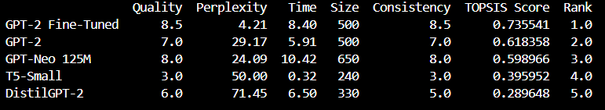
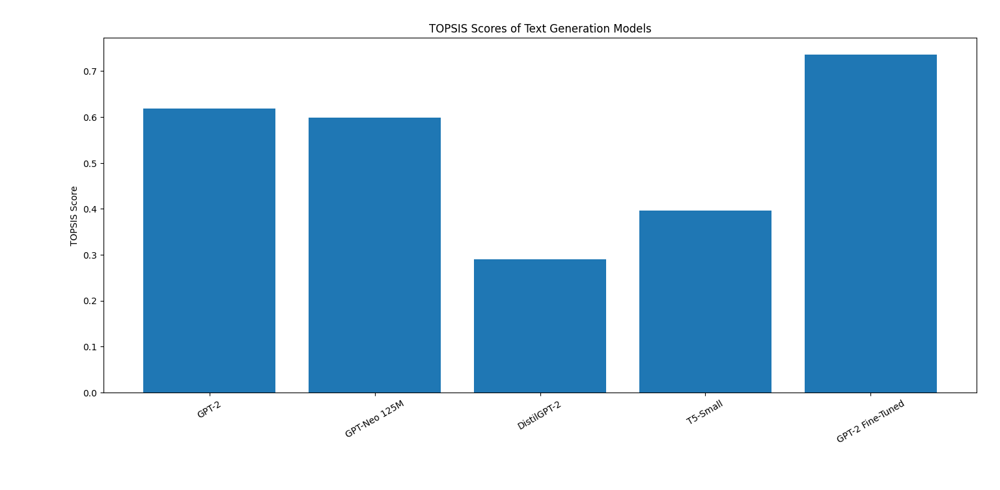
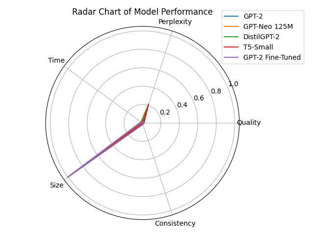

# 📘 Text Generation Model Evaluation using TOPSIS
**Author:** Lavanya Garg  
**Roll Number:** 102313066  
**Course:** Predictive Analysis  

# 1️⃣ Introduction
Text generation is a fundamental task in Natural Language Processing (NLP), where models generate coherent and meaningful text given an input prompt. Different text generation models exhibit varying trade-offs in terms of quality, computational efficiency, and resource usage.

Selecting the most suitable model is therefore a **multi-criteria decision-making problem**.

In this project, the **TOPSIS (Technique for Order Preference by Similarity to Ideal Solution)** method is applied to systematically evaluate and rank multiple text generation models based on experimental results.

---

# 2️⃣ Objectives
The objectives of this project are:
- To evaluate multiple text generation models experimentally
- To compare models using meaningful quantitative and qualitative criteria
- To apply the TOPSIS decision-making method for ranking
- To analyze the impact of **fine-tuning** on text generation performance

---

# 3️⃣ Models Considered
The following models were evaluated to ensure architectural and performance diversity:

```text
|       Model        |              Description                          |
|--------------------|---------------------------------------------------|
| GPT-2              | Baseline autoregressive language model            |
| GPT-Neo 125M       | Larger GPT-style model with improved coherence    |
| DistilGPT-2        | Compressed version of GPT-2 (faster, lightweight) |
| T5-Small           | Encoder–decoder, instruction-based model          |
| GPT-2 (Fine-Tuned) | GPT-2 fine-tuned on domain-specific data          |

```
---

# 4️⃣ Experimental Setup
- **Prompt used:**  
  > *"The future of artificial intelligence is"*
- All models were executed locally using the **HuggingFace Transformers** library.
- Inference time and perplexity were measured experimentally.
- Fine-tuning was performed on a small, domain-specific dataset.

---

# 5️⃣ Evaluation Criteria
Five criteria were selected for holistic evaluation:

```text
|       Criterion      |    Type   |              Description                     |
|----------------------|-----------|----------------------------------------------|
| Text Quality         | Benefit ↑ | Human-evaluated relevance and fluency (1–10) |
| Perplexity           | Cost ↓    | Model confidence (lower is better)           |
| Inference Time (sec) | Cost ↓    | Time taken to generate text                  |
| Model Size (MB)      | Cost ↓    | Storage and memory requirements              |
| Consistency          | Benefit ↑ | Stability of output across runs (1–10)       |
```
---

# 6️⃣ Criteria Weights
The following weights were assigned based on relative importance:

```text
|  Criterion  | Weight |
|-------------|--------|
| Quality     |  0.30  |
| Perplexity  |  0.25  |
| Time        |  0.15  |
| Size        |  0.10  |
| Consistency |  0.20  |

*(Sum of weights = 1.0)*
```
---

# 7️⃣ Decision Matrix
The experimentally obtained decision matrix is shown below:

```text
|        Model       | Quality | Perplexity |  Time  | Size | Consistency |
|--------------------|---------|------------|--------|------|-------------|
| GPT-2              |   7.0   |   29.17    |  5.91  |  500 |     7.0     |
| GPT-Neo 125M       |   8.0   |   24.09    |  10.42 |  650 |     8.0     |
| DistilGPT-2        |   6.0   |   71.45    |  6.50  |  330 |     5.0     |
| T5-Small           |   3.0   |   50.00    |  0.32  |  240 |     3.0     |
| GPT-2 (Fine-Tuned) |   8.5   |   4.21     |  8.40  |  500 |     8.5     |
```
---

# 8️⃣ TOPSIS Methodology
The TOPSIS method was applied using the following steps:
1. Normalization of the decision matrix
2. Weight assignment to criteria
3. Identification of ideal best and ideal worst solutions
4. Euclidean distance calculation
5. Computation of TOPSIS scores and final ranking

---

# 9️⃣ Results and Ranking
The final ranking obtained after applying the TOPSIS method is shown below.
The results were generated directly from the terminal after executing `topsis.py`.



---

# 🔟 Visual Analysis

## 🔹 TOPSIS Score Comparison (Bar Chart)


## 🔹 Radar Chart of Model Performance


---

# 1️⃣1️⃣ Discussion
The results demonstrate that **fine-tuning significantly improves text generation performance**, especially in terms of perplexity, relevance, and consistency. While larger models such as GPT-Neo offer improved coherence, they require greater computational resources. Lightweight models like DistilGPT-2 provide faster inference but suffer from reduced confidence.

---

# 1️⃣2️⃣ Conclusion
Using the TOPSIS multi-criteria decision-making method, the **fine-tuned GPT-2 model** achieved the highest overall rank. This confirms that lightweight domain-specific fine-tuning can outperform larger pre-trained models when evaluated holistically across multiple criteria.

---

# 1️⃣3️⃣ Tools and Technologies
- Python
- HuggingFace Transformers
- PyTorch
- NumPy, Pandas
- Matplotlib

---

# 1️⃣4️⃣ How to Run
```bash
pip install torch transformers numpy pandas matplotlib
python generate_*.py
python perplexity_*.py
python topsis.py
python graphs.py
